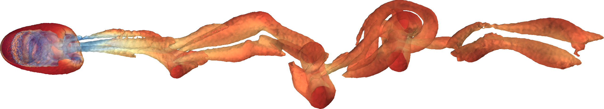

Teal is a C library for computational fluid dynamics. It solves the compressible Euler and
Navier-Stokes equations on 3D unstructured meshes using the finite-volume method. Conservation laws,
flux schemes, and boundary conditions are interchangeable and can easily be extended to new physics.



## Highlights

**Meshes**
- 3D unstructured mixed meshes
- Cartesian mesh generator
- Parallel reader for Gmsh
- Extensible to additional formats

**Equations**
- Compressible Euler and Navier-Stokes
- User-defined source terms
- Modular design for adding other conservation laws

**Accuracy**
- 2nd-order spatial accuracy
    - Least-squares gradient reconstruction
- Up to 3rd-order temporal accuracy
    - Low-storage explicit Runge-Kutta schemes
    - Implicit Euler with Newton-GMRES solver

## Getting started

Clone and build:

```bash
git clone https://github.com/hheinzer/teal.git
cd teal
make
```

Executables are placed in the `bin` directory.

The best way to get started with teal is by running test cases in [run](run/). For example:

```bash
mpirun -n 4 bin/supersonic_wedge/run
```

Visualize the resulting VTKHDF files directly with ParaView.

The test cases demonstrate all capabilities of teal. If your editor supports "jump to definition",
you can follow the program flow directly in the source. Function names and inline comments should be
enough to understand what's going on.

## Requirements

- Clang or GCC (set `CC` in `Makefile`) plus `make`
- MPI implementation (Open MPI or MPICH) with `mpicc`
- HDF5 **built with MPI support** (headers + libs)
- METIS and ParMETIS (ParMETIS must match your METIS build)
- Gmsh (to generate meshes from `.geo` files)
- ParaView (to visualize the results)

## Performance

To assess the [strong scaling](https://hpc-wiki.info/hpc/Scaling) of teal, the [Taylor-Green
vortex](run/taylor_green_vortex/) test case was run at three resolutions with varying numbers of MPI
ranks for a fixed number of iterations. Speedup and efficiency are computed relative to the 128-rank
baseline.

| cells | iters | ranks | time     | speedup | efficiency [%] |
| ----- | ----- | ----- | -------- | ------- | -------------- |
| 128^3 | 25000 | 128   | 40m 36.2s | 1.00   | 100.0          |
| 128^3 | 25000 | 256   | 18m 35.8s | 2.18   | 109.2          |
| 128^3 | 25000 | 512   | 9m 16.4s  | 4.38   | 109.5          |
| 128^3 | 25000 | 1024  | 5m 11.1s  | 7.83   | 97.9           |
| 256^3 | 3000  | 128   | 42m 48.9s | 1.00   | 100.0          |
| 256^3 | 3000  | 256   | 21m 10.1s | 2.02   | 101.1          |
| 256^3 | 3000  | 512   | 10m 24.5s | 4.11   | 102.8          |
| 256^3 | 3000  | 1024  | 5m 11.3s  | 8.25   | 103.2          |
| 512^3 | 330   | 128   | 36m 57.3s | 1.00   | 100.0          |
| 512^3 | 330   | 256   | 18m 14.7s | 2.03   | 101.3          |
| 512^3 | 330   | 512   | 9m 37.3s  | 3.84   | 96.0           |
| 512^3 | 330   | 1024  | 5m 3.6s   | 7.30   | 91.3           |

## Contributing

Contributions are welcome!

If you find a bug or have a feature request, please open an issue. To contribute code:

1. Fork the repository
2. Create a new branch for your feature or bug fix
3. Commit your changes and push to your fork
4. Open a pull request to the `next` branch

## Acknowledgments

Teal is a successor to [ccfd](https://github.com/hheinzer/ccfd), which itself is a C rewrite of
[cfdfv](https://github.com/flexi-framework/cfdfv). While teal builds on the concepts of these
projects, it does not share any code with them.

The development of teal has been guided by foundational literature in computational fluid dynamics.
Key resources include *Computational Fluid Dynamics: Principles and Applications* by J. Blazek and
*Riemann Solvers and Numerical Methods for Fluid Dynamics: A Practical Introduction* by E. F. Toro.

## License

Teal is licensed under the GPL-3.0 [license](LICENSE).
